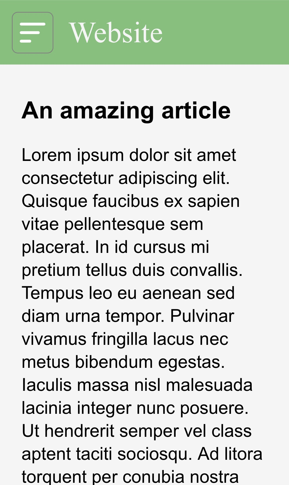
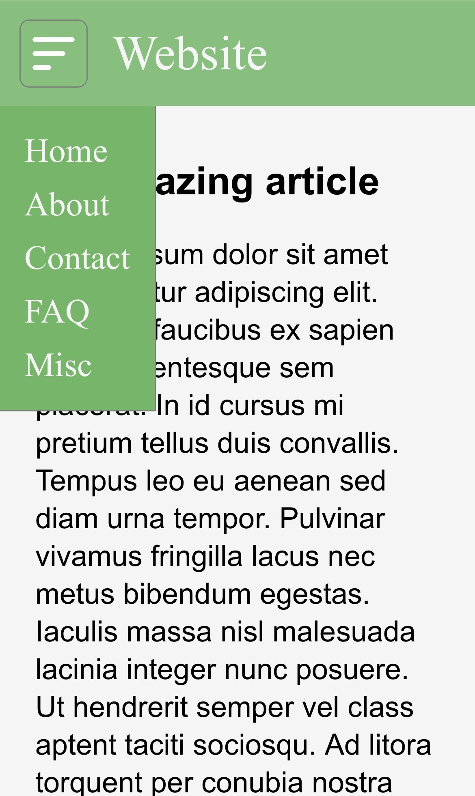
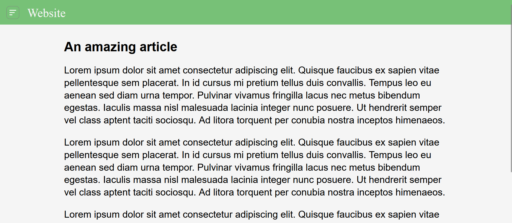
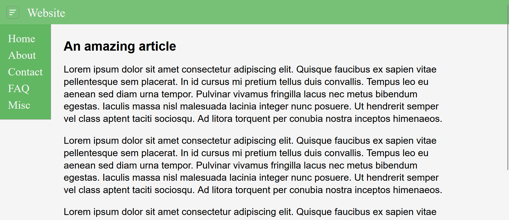

# dropdown

An experiment in implementing a dropdown menu using HTML/CSS/JS, inspired by the mobile version of luajit.org.

## How it looks

### Mobile

Dropdown closed (default, of course)

 

Dropdown open

### Desktop

Dropdown closed (default, of course)

 

Dropdown open

## Conclusion

I like the shades of green. I think the dropdown looks believable. I would even describe it as cute haha. However, I think on desktop it makes things look too spacious. And even on mobile, I'm wondering whether it's too small. I think maybe a near-fullscreen 'burger menu', as on baeldung.com (no, I did not steal their design!) might be the better approach for mobile. And then just have nav items along the top, next to the title. However, that is, of course, more work. But I think that'd maybe look less awkward. I'm not sure dropdowns look right on mobile devices. Maybe they just don't look proportional?

But it was an interesting experiment, nonetheless, with more CSS learning.

*~Marc Reed*